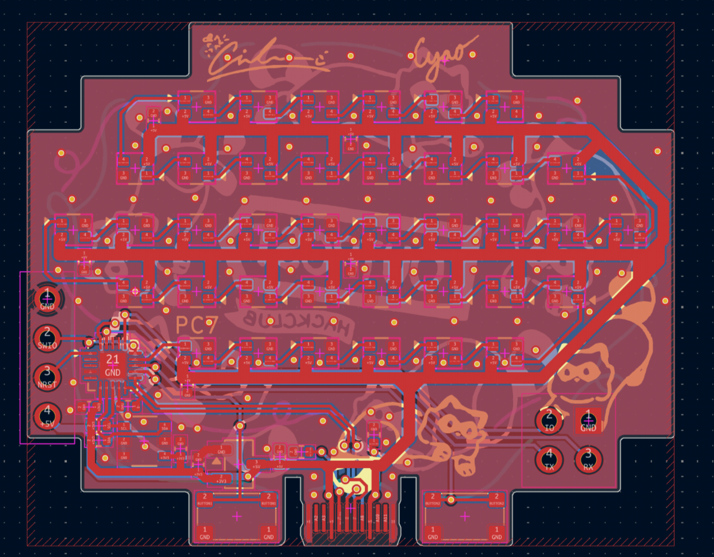
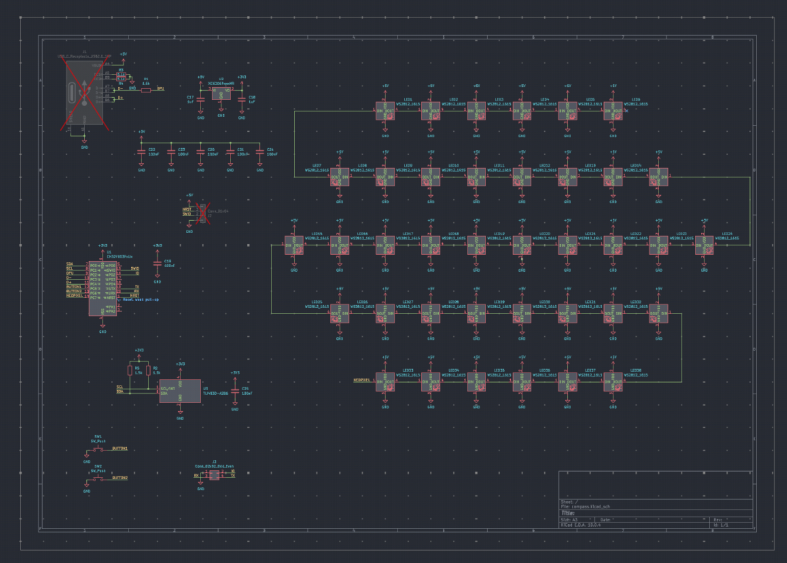

# Compass

Modular PCB compass powered by ch32v003 and neopixels! Including a built-in magnetic field sensor.

You can make a custom pcb compass with this!!!

Features:
- ch32v003
- bunch of neopixels
- art
- easy to use
- board edge usb connector
- usb connection
- ch32
- riscv

BOM:

| Item | Price |
| ---- | ----- |
| PCB PCBA | $70 |
