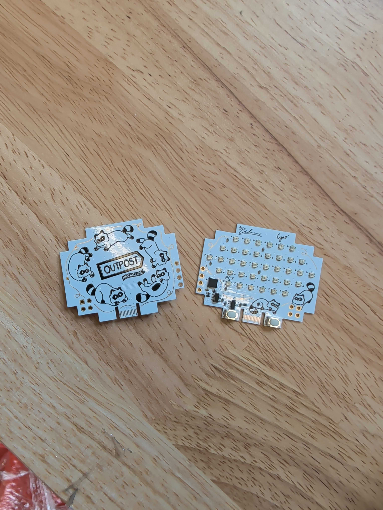

# Compass

Modular PCB compass powered by ch32v003 and neopixels! Including a built-in magnetic field sensor. You can make a custom Minecraft compass with this!

It is recommended to use [ch32fun](https://github.com/cnlohr/ch32fun?tab=readme-ov-file) with [rv003usb](https://github.com/cnlohr/rv003usb/tree/master/bootloader)

To program the usb bootloader (one time), you can use a pico, arduino, esp32-s2 or whatever!

Features:
- ch32v003
- bunch of neopixels
- art
- easy to use
- board edge usb connector
- usb connection
- ch32
- riscv

